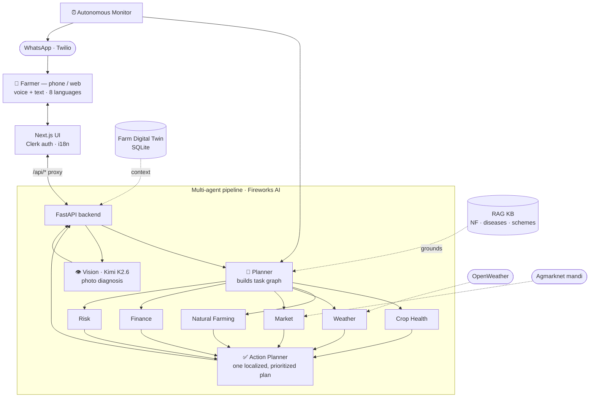

<div align="center">

#  KrishiMitra AI

</div>

https://github.com/user-attachments/assets/0f65f612-8bf2-4ddf-85e4-801a0dfd8b00

**Agentic Agronomy Operating System for Natural Farming.**

An autonomous, multilingual AI agronomist that diagnoses crop problems, plans
interventions, tracks farm health, predicts risks, and guides farmers through
natural farming - voice-first, in Hindi & English.

> Instead of *"Ask me something"*, KrishiMitra says: *"I know your farm, crops,
> weather, soil, disease history and market. Here's what to do next."*

---

## Brief coverage (Option B — Voice-Based Natural Farming Consultant)

The brief asks to implement **2** of the four feature areas; KrishiMitra ships **all four**,
voice-first and multilingual:

| Requirement | Where |
|---|---|
| ✅ **Disease Identification & Treatment** | Photo → vision diagnosis + organic remedy (`Diagnose`); symptom-based `Crop Health` agent |
| ✅ **Seed & Financial Guidance** | Multilayer cropping/seed designer (`Planner`); `Finance` agent on real schemes (PM-KISAN, PKVY, PMFBY) |
| ✅ **Weather & Market Intelligence** | Real OpenWeather forecast + Agmarknet mandi prices, with sell/spray advice |
| ✅ **Natural Farming Education** | `Natural Farming` agent + multilevel **Cropping Designer** (4-layer food forest), RAG-grounded |

**Technical constraints:** STT/TTS audio pipeline (Web Speech, per-language locale) · mobile/smart-board
web UI (Next.js) · RAG corpus + strict JSON prompt guardrails for farming accuracy (see **Prompt design**).

---

## What's inside

### Multi-agent backend (FastAPI + Fireworks AI)
A real agentic pipeline - not one LLM:



| Agent | Role |
|-------|------|
| **Planner** | Breaks each request into a task graph and routes it |
| **Crop Health** | Disease / pest / nutrient diagnosis |
| **Natural Farming** | Jeevamrut, neem, organic remedies (RAG-grounded) |
| **Weather** | Forecast-aware spray & irrigation timing |
| **Market** | Mandi prices, trend, when to sell |
| **Finance** | Govt schemes, subsidies, insurance |
| **Risk** | Predicts outbreaks from weather + history |
| **Action Planner** | Synthesizes one prioritized, bilingual plan |
| **Vision** | Crop-disease diagnosis from a photo (Kimi K2.6 multimodal) |

**Models (Fireworks):** `gpt-oss-120b` for the text agents (fast, JSON-reliable via
`reasoning_effort`), **`kimi-k2p6`** for image diagnosis (multimodal), with
`deepseek-v4-pro` (1M ctx) available as a heavy option.

Other pieces: SQLite **Farm Digital Twin** (memory/CRM), a lightweight **RAG**
knowledge base (natural farming + diseases + schemes), and swappable weather/market
services.

### Frontend (Next.js 14 + Tailwind + Framer Motion)
A cinematic, aceternity/magic-style dark UI: aurora hero, spotlight cards, animated
gauges & counters, bento grids, live charts.

- **Dashboard** - farm health score, proactive alerts, forecast, risk, mandi prices, activity timeline
- **Talk to KrishiMitra** - voice (Web Speech) + text consult; shows agent routing; bilingual answer read aloud
- **Diagnose Crop** - drag-drop image → vision diagnosis + natural treatment
- **Farm Planner** - weekly coach + multilayer cropping designer
- **Market** - prices, 7-day trend charts, sell advice

---

## Auth & data

- **Auth: Clerk.** Sign-up / sign-in, sessions, and a user menu. Every farm is keyed
  by the Clerk user id; the backend verifies the Clerk session JWT (RS256 via JWKS) on
  every request. No anonymous access, no demo user.
- **No hardcoded data.** There is no seeded farm - each user builds their own farm
  (digital twin) through an **onboarding** flow. Weather is **real OpenWeather**
  (location geocoded at onboarding) and market prices are **real Agmarknet** mandi data
  via data.gov.in. If a key is missing, the relevant section shows a clear error rather
  than fake numbers.

## More capabilities
- **8 languages, fully localized** - Hindi, English, Punjabi, Marathi, Tamil, Telugu,
  Bengali, Gujarati. The *entire* UI plus every agent answer renders in the farm's
  language (native script). Voice is multilingual too: speech-to-text and text-to-speech
  bind to the chosen language's locale (`hi-IN`, `ta-IN`, `bn-IN`, …). See **Localization** below.
- **Autonomous monitoring** - a background scheduler runs the risk/weather/market agents
  for every farm on a schedule and raises in-app **notifications** (bell in the sidebar).
  "Run check now" on the dashboard triggers it on demand.
- **WhatsApp (Twilio)** - proactive alerts are pushed to the farmer's WhatsApp, and farmers
  can ask questions or send a crop photo on WhatsApp; replies route through the same agents.
  Point your Twilio WhatsApp webhook at `POST /api/whatsapp` (use ngrok in dev).
- **Soil Health Card import** - upload the government soil card (Planner → Soil card);
  Kimi vision extracts pH / N-P-K / organic carbon into the farm twin.

## Prompt design

The accuracy strategy is **structured multi-agent prompts + RAG grounding + JSON guardrails**,
not a single open-ended chatbot.

- **Role-scoped agents.** Each agent ([`backend/app/agents/prompts.py`](backend/app/agents/prompts.py))
  has a tight system prompt fixed to one job — `PLANNER`, `CROP_HEALTH`, `NATURAL_FARMING`,
  `WEATHER`, `MARKET`, `FINANCE` (subsidies), `RISK`, `ACTION_PLANNER`, `VISION_DIAGNOSIS`,
  `CROPPING_DESIGNER`, `SOIL_CARD`, `WEEKLY_COACH`. The Planner routes a query into a task
  graph; specialists run in parallel; the Action Planner synthesizes one prioritized answer.
- **RAG grounding for accuracy.** Free-text agents are fed retrieved chunks from a curated
  agronomy corpus ([`services/knowledge.py`](backend/app/services/knowledge.py)) — natural-farming
  preparations (Jeevamrut, Beejamrut, Panchagavya, neem), disease playbooks, and government
  schemes (PM-KISAN, PKVY, PMFBY). Prompts instruct agents to **only** prescribe from this
  knowledge and the farm's real data, never invent remedies or dosages.
- **Strict JSON guardrails.** Every text agent runs through `fireworks.chat_json` with
  `json_mode` + `reasoning_effort`, returning a fixed schema (e.g. risk → `{level, score,
  primary_risk, reason, mitigation}`). Malformed output is caught and the section degrades
  gracefully instead of leaking a hallucinated paragraph.
- **Real-data context, no fabrication.** Weather (OpenWeather) and mandi prices (Agmarknet)
  are injected as facts; if a source is unavailable the agent says so rather than guessing.

## Localization

Whole-app localization across all 8 languages, built as a **runtime LLM-translation service
with caching** so we never hand-maintain thousands of strings.

- **Static UI** — components call `t("English string")` ([`lib/i18n-runtime.tsx`](frontend/lib/i18n-runtime.tsx)).
  The provider collects untranslated strings, batch-POSTs them to `POST /api/i18n`
  ([`services/i18n.py`](backend/app/services/i18n.py)), which translates via the LLM and
  **caches to disk** (`data/i18n_cache/<lang>.json`) — every string is translated once, ever.
  Results are also cached per-browser in `localStorage` (versioned key), so loads are instant.
- **AI content** — agent output is localized at the source: the dashboard's risk/alerts/advice
  are translated server-side in one cached batch; consult & diagnosis answers come back in the
  farm's language (`answer_local` / `explanation_local`) directly from the agents.
- **Farmer-friendly transliteration** — Indian farming terms and crop names are transliterated
  into the native script (Jeevamrut → जीवामृत, Tomato → टमाटर) rather than left in Latin; only
  the brand name "KrishiMitra", units, and model names stay as-is.
- **Voice follows language** — STT and TTS use the selected language's `-IN` locale, so a Tamil
  or Bengali farmer can speak and be answered in their own language.
- The hero copy is hand-translated for quality ([`lib/i18n.ts`](frontend/lib/i18n.ts)); everything
  else flows through the runtime service.

## Required keys

You need three external services (all have free tiers):

| Key | Where | Used for |
|-----|-------|----------|
| `FIREWORKS_API_KEY` | fireworks.ai | the agents + vision (already set) |
| Clerk keys | clerk.com → API Keys | authentication |
| `OPENWEATHER_API_KEY` | openweathermap.org | real forecast + geocoding |
| `DATA_GOV_API_KEY` | data.gov.in | real mandi prices (Agmarknet); a public sample key is the default |
| Twilio (optional) | twilio.com | WhatsApp alerts + inbound Q&A |

## Run it

### 1. Backend
```bash
cd backend
python3.12 -m venv venv && source venv/bin/activate
pip install -r requirements.txt
cp .env.example .env   # then fill in the keys (FIREWORKS is already set)
uvicorn app.main:app --reload --port 8000
```
Set `CLERK_ISSUER` to your Clerk JWT issuer (e.g. `https://your-app.clerk.accounts.dev`).
API docs at http://127.0.0.1:8000/docs

### 2. Frontend
```bash
cd frontend
npm install
cp .env.example .env.local   # add your Clerk publishable + secret keys
npm run dev                  # http://localhost:3000
```
The frontend proxies `/api/*` to the backend (see `next.config.mjs`) and attaches the
Clerk session token to each call.

---

## Notes
- The Clerk publishable key (frontend) and `CLERK_ISSUER` (backend) must be from the
  **same** Clerk instance.
- **Voice** uses the browser Web Speech API (Chrome/Edge) - no extra keys. STT/TTS bind to
  the farmer's language locale (`hi-IN`, `pa-IN`, `ta-IN`, …) for true voice-first multilingual use.
- **DB** is SQLite for zero-setup; the `FarmMemory` surface is small enough to swap
  for PostgreSQL.
