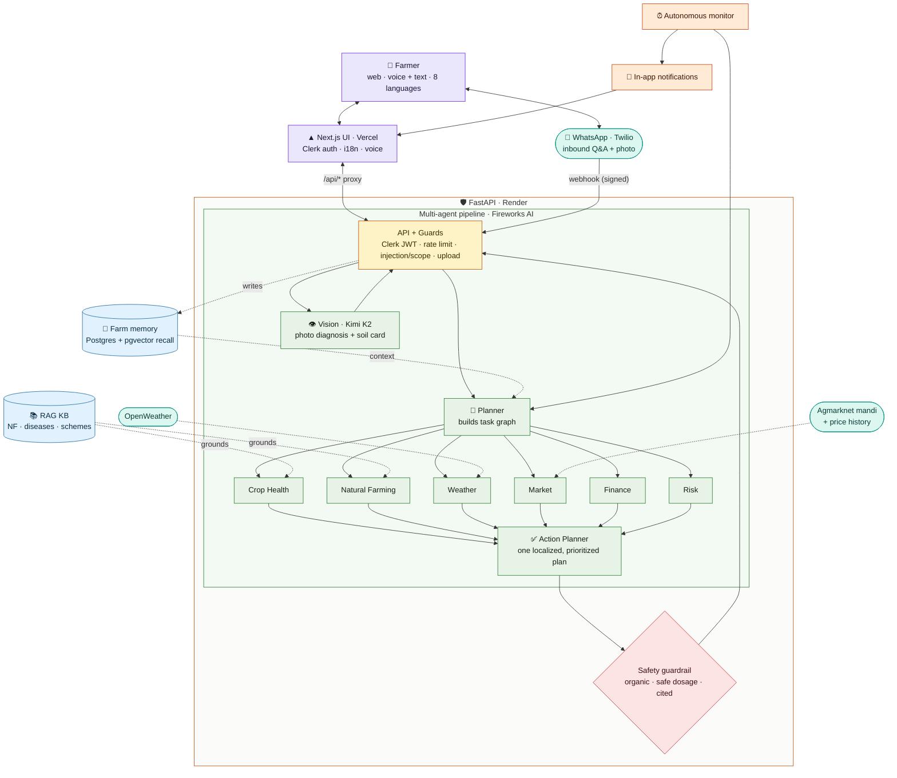

<div align="center">

#  KrishiMitra AI

**Agentic Agronomy Operating System for Natural Farming.**

[](https://krishi-mitra-meesho.vercel.app/)
[](https://wa.me/14155238886?text=join%20long-principle)

</div>

https://github.com/user-attachments/assets/0f65f612-8bf2-4ddf-85e4-801a0dfd8b00

An autonomous, multilingual AI agronomist that diagnoses crop problems, plans
interventions, tracks farm health, predicts risks, and guides farmers through
natural farming - voice-first, in 8 Indian languages.

> Instead of *"Ask me something"*, KrishiMitra says: *"I know your farm, crops,
> weather, soil, disease history and market. Here's what to do next."*

---

## What it does

Four capability areas, all voice-first and multilingual:

| Capability | Where |
|---|---|
| **Disease Identification & Treatment** | Photo → vision diagnosis + organic remedy (`Diagnose`); symptom-based `Crop Health` agent |
| **Seed & Financial Guidance** | Multilayer cropping/seed designer (`Planner`); `Finance` agent on real schemes (PM-KISAN, PKVY, PMFBY) |
| **Weather & Market Intelligence** | Real OpenWeather forecast + Agmarknet mandi prices, with sell/spray advice |
| **Natural Farming Education** | `Natural Farming` agent + multilevel **Cropping Designer** (4-layer food forest), RAG-grounded |

Built on an STT/TTS audio pipeline (Web Speech, per-language locale) · mobile/smart-board
web UI (Next.js) · RAG corpus + strict JSON prompt guardrails for farming accuracy (see **Prompt design**).

---

## Architecture

A real agentic pipeline - not one LLM. A Planner routes each request to specialist
agents that run **in parallel**, and an Action Planner merges them into a single,
localized, prioritized plan. Every answer is grounded in real data and passes a
safety guardrail before it reaches the farmer.



### The agents

| Agent | Role |
|-------|------|
| **Planner** | Breaks each request into a task graph and routes it |
| **Crop Health** | Disease / pest / nutrient diagnosis (RAG-grounded) |
| **Natural Farming** | Jeevamrut, neem, organic remedies (RAG-grounded) |
| **Weather** | Forecast-aware spray & irrigation timing |
| **Market** | Mandi prices, cross-market spread, trend, when to sell |
| **Finance** | Govt schemes, subsidies, insurance |
| **Risk** | Predicts outbreaks from weather + history |
| **Action Planner** | Synthesizes one prioritized, localized plan |
| **Vision** | Crop-disease diagnosis from a photo + soil-card reading (Kimi multimodal) |
| **Cropping Designer / Weekly Coach** | Multilayer food-forest design and personalized weekly plan |

Dependencies are real: **Crop Health → Natural Farming** (the remedy needs the
diagnosis) and **Weather → Risk**; everything else runs concurrently via `asyncio`.
Each specialist fails independently, so one bad upstream never blanks the answer.

**Models (Fireworks):** `gpt-oss-120b` for the text agents (fast, JSON-reliable via
`reasoning_effort`), **`kimi-k2p6`** for image diagnosis (multimodal), a 768-dim
embedding model for semantic memory, with `deepseek-v4-pro` (1M ctx) available as a
heavy option.

### Frontend (Next.js 14 + Tailwind + Framer Motion)

A cinematic dark UI: aurora hero, spotlight cards, animated gauges & counters, bento
grids, live charts.

- **Dashboard** - farm health score, proactive alerts, forecast, risk, mandi prices, activity timeline
- **Consult** - voice (Web Speech) + text; shows agent routing; localized answer read aloud
- **Diagnose** - drag-drop image → vision diagnosis + natural treatment
- **Planner** - weekly coach + multilayer cropping designer + crop calendar
- **Market** - live mandi rates, cross-market price distribution, and an accumulating day-over-day trend
- **Profile** - multi-farm profiles, language, and WhatsApp linking (one-tap "Open WhatsApp & join")

---

## Data & persistence

- **Postgres + pgvector**, via async SQLAlchemy ([`app/core/db.py`](backend/app/core/db.py),
  [`services/memory.py`](backend/app/services/memory.py)).
  Tables: profiles, farms, crop cycles, calendar tasks, events, notifications,
  interactions (chat history), **memories** (embedded for semantic recall), and
  **price snapshots** (daily mandi price history). Schema is managed by **Alembic**
  migrations (`backend/alembic/versions/`).
- **Semantic farm memory.** Every consult/diagnosis is embedded and stored; the
  Planner recalls the most relevant past interactions (pgvector cosine distance) to
  ground new advice in this farm's history.
- **No hardcoded data.** There is no seeded farm - each user builds their own farm
  (digital twin) through **onboarding**. Weather is **real OpenWeather** (geocoded at
  onboarding) and prices are **real Agmarknet** mandi data via data.gov.in. If a key
  is missing or a source is down, the section shows a clear message rather than fake
  numbers - it never invents values.

### Market intelligence & price history

Agmarknet's daily API is a **single-day snapshot** (no time series), so the Market
page does two honest things:

- **Cross-market spread (today):** every reporting mandi is a dot on a low→high price
  axis, with the farmer's local mandi and the best-priced mandi highlighted - so you
  see clustering, outliers, and where to sell.
- **Day-over-day trend (accumulated):** each fetch persists a `price_snapshots` row
  per (commodity, region, day), building a real time series over time. Once ≥2 days
  exist, the card shows a genuine trend line and % change. The autonomous monitor
  refreshes this even without user visits. The same data is fed to the Market agent,
  so its advice is grounded in the real trend.

---

## Auth, trust & safety

- **Auth: Clerk.** Every farm is keyed by the Clerk user id; the backend verifies the
  Clerk session JWT (RS256 via JWKS) on every request. Data is farm-scoped - one user
  can never read another's farm.
- **Input guards** ([`app/core/guards.py`](backend/app/core/guards.py)): deterministic
  prompt-injection neutralization (farmer text is fenced as data) and scope deflection
  (off-topic requests are refused before spending agent calls).
- **Rate limiting** ([`app/core/limits.py`](backend/app/core/limits.py)): every
  money-spending endpoint is throttled per Clerk user (public routes by IP) so no one
  can drain the AI budget.
- **Image relevance guard:** the vision model flags non-crop photos and refuses to
  invent a diagnosis rather than hallucinate one.
- **Agronomic safety:** prompts prescribe **only** from the RAG knowledge base and the
  farm's real data; natural-farming methods are prioritized over synthetic chemicals;
  agents state confidence/uncertainty instead of overclaiming.
- **Observability:** optional Sentry (`SENTRY_DSN`) with per-agent timing metrics.

---

## More capabilities

- **8 languages, fully localized** - Hindi, English, Punjabi, Marathi, Tamil, Telugu,
  Bengali, Gujarati. The *entire* UI plus every agent answer renders in the farm's
  language (native script). Voice binds STT/TTS to the language locale (`hi-IN`,
  `ta-IN`, `bn-IN`, …). See **Localization**.
- **Autonomous monitoring** - a background scheduler runs the risk/weather/market
  agents for every farm on a schedule and raises **in-app notifications** (bell in the
  sidebar). "Run check now" on the dashboard triggers it on demand. (In-app only -
  proactive WhatsApp reminders were removed; WhatsApp is inbound.)
- **WhatsApp (Twilio)** - an **inbound** Q&A channel: a farmer sends a crop photo
  (diagnose) or a question (consult) and it routes through the same agents, replying on
  WhatsApp. The Twilio sandbox join code is surfaced in the UI with a one-tap
  **"Open WhatsApp & join"** link (Profile + landing page), and the webhook is Twilio
  **signature-validated** (`POST /api/whatsapp`). See **WhatsApp setup**.
- **Soil Health Card import** - upload the government soil card (Planner → Soil card);
  Kimi vision extracts pH / N-P-K / organic carbon into the farm twin.

## Prompt design

The accuracy strategy is **structured multi-agent prompts + RAG grounding + JSON guardrails**,
not a single open-ended chatbot.

- **Role-scoped agents.** Each agent ([`backend/app/agents/prompts.py`](backend/app/agents/prompts.py))
  has a tight system prompt fixed to one job — `PLANNER`, `CROP_HEALTH`, `NATURAL_FARMING`,
  `WEATHER`, `MARKET`, `FINANCE`, `RISK`, `ACTION_PLANNER`, `VISION_DIAGNOSIS`,
  `CROPPING_DESIGNER`, `SOIL_CARD`, `WEEKLY_COACH`.
- **RAG grounding for accuracy.** Free-text agents are fed retrieved chunks from a curated
  agronomy corpus ([`services/knowledge.py`](backend/app/services/knowledge.py)) — natural-farming
  preparations (Jeevamrut, Beejamrut, Panchagavya, neem), disease playbooks, and government
  schemes. Prompts instruct agents to **only** prescribe from this knowledge and the farm's
  real data.
- **Strict JSON guardrails.** Every text agent runs through `fireworks.chat_json` with
  `json_mode` + `reasoning_effort`, returning a fixed schema. Malformed output is caught and
  the section degrades gracefully instead of leaking a hallucinated paragraph.

## Localization

Whole-app localization across all 8 languages, built as a **runtime LLM-translation service
with caching** so we never hand-maintain thousands of strings.

- **Static UI** — components call `t("English string")` ([`lib/i18n-runtime.tsx`](frontend/lib/i18n-runtime.tsx)).
  Untranslated strings are batch-POSTed to `POST /api/i18n` ([`services/i18n.py`](backend/app/services/i18n.py)),
  translated once via the LLM and **cached to disk** (`data/i18n_cache/<lang>.json`) and per-browser.
- **AI content** — agent output is localized at the source (`answer_local` / `explanation_local`);
  dashboard risk/alerts/advice are translated server-side in one cached batch.
- **Farmer-friendly transliteration** — farming terms and crop names render in native script
  (Jeevamrut → जीवामृत, Tomato → टमाटर); brand name, units, and model names stay as-is.
- **Voice follows language** — STT and TTS use the selected language's `-IN` locale.

---

## Required keys

| Key | Where | Used for |
|-----|-------|----------|
| `DATABASE_URL` | Render Postgres (with the `pgvector` extension) | all persistence + semantic memory |
| `FIREWORKS_API_KEY` | fireworks.ai | the agents + vision + embeddings |
| Clerk keys | clerk.com → API Keys | authentication (frontend + `CLERK_ISSUER` backend) |
| `OPENWEATHER_API_KEY` | openweathermap.org | real forecast + geocoding |
| `DATA_GOV_API_KEY` | data.gov.in | real mandi prices (Agmarknet); a public sample key is the default |
| Twilio (optional) | twilio.com | WhatsApp inbound Q&A |

### Overriding the shared `DATA_GOV_API_KEY`

Mandi prices work out of the box because the app defaults to **data.gov.in's public
sample key**, which is shared and rate-limited across every project that uses it — so
under real usage you'll hit 429s and see *"Market data unavailable"*. Get your own
(free, ~2 minutes): register at [data.gov.in](https://data.gov.in) → **My Account** →
copy your API key → set `DATA_GOV_API_KEY` in `backend/.env` (or the backend host's env)
and restart. The key is backend-only — never expose it to the browser.

## Run it

### 1. Backend (FastAPI → http://127.0.0.1:8000)
```bash
cd backend
python3.12 -m venv venv && source venv/bin/activate
pip install -r requirements.txt
cp .env.example .env          # fill in the keys below
alembic upgrade head          # create tables (needs DATABASE_URL → Postgres + pgvector)
uvicorn app.main:app --reload --port 8000
```
Required env: `DATABASE_URL` (Postgres with the `pgvector` extension), `FIREWORKS_API_KEY`,
and `CLERK_ISSUER` (e.g. `https://your-app.clerk.accounts.dev`). API docs at
http://127.0.0.1:8000/docs.

Run the tests (needs dev extras):
```bash
pip install -r requirements.txt -r requirements-dev.txt
pytest            # auth, guardrails, rate limits, WhatsApp signature validation
```

### 2. Frontend (Next.js → http://localhost:3000)
```bash
cd frontend
npm install
cp .env.example .env           # add Clerk keys; set BACKEND_URL=http://127.0.0.1:8000
npm run dev
```
The frontend proxies `/api/*` to the backend (`next.config.mjs`, via `BACKEND_URL`) and
attaches the Clerk session token to each call.

### 3. WhatsApp setup (optional)

1. Twilio Console → Messaging → **WhatsApp sandbox**. Note the sandbox number and join code.
2. Set the inbound webhook ("when a message comes in") to `<backend>/api/whatsapp` (POST).
3. Backend env: `TWILIO_ACCOUNT_SID`, `TWILIO_AUTH_TOKEN`,
   `TWILIO_WHATSAPP_FROM=whatsapp:+14155238886`, `TWILIO_SANDBOX_JOIN_CODE=<code>`,
   `TWILIO_WEBHOOK_URL=<backend>/api/whatsapp` (needed because signature validation is on).
4. In the app, tap **Open WhatsApp & join** (prefills `join <code>`), then send a crop
   photo or a question.

---

## Deploy

- **Frontend → Vercel.** Set the Clerk keys and `BACKEND_URL=<your Render backend>`.
- **Backend → Render.** Provision a Postgres instance with the `pgvector` extension,
  set `DATABASE_URL` and the keys above, run `alembic upgrade head` on deploy.

## Notes

- The Clerk publishable key (frontend) and `CLERK_ISSUER` (backend) must be from the
  **same** Clerk instance.
- **Voice** uses the browser Web Speech API (Chrome/Edge) - no extra keys. STT/TTS bind
  to the farmer's language locale for true voice-first multilingual use.
- **DB** is Postgres + pgvector; the `pgvector` extension is required for semantic memory.
